# id-bench

Identifier benchmarking

## UUID

| Version | Description                                                                                                                                                                                                                                                                                                                                                                        |
|---------|------------------------------------------------------------------------------------------------------------------------------------------------------------------------------------------------------------------------------------------------------------------------------------------------------------------------------------------------------------------------------------|
| 1       | The time-based version.                                                                                                                                                                                                                                                                                                                                                            |
| 2       | DCE Security version, with embedded POSIX UIDs.                                                                                                                                                                                                                                                                                                                                    |
| 3       | The name-based version that uses MD5 hashing. Implementations SHOULD utilize UUID version 5 if possible.                                                                                                                                                                                                                                                                           |
| 4       | The randomly or pseudo-randomly generated version.                                                                                                                                                                                                                                                                                                                                 |
| 5       | The name-based version that uses SHA-1 hashing                                                                                                                                                                                                                                                                                                                                     |
| 6       | UUID version 6 is a field-compatible version of UUIDv1, reordered for improved DB locality. It is expected that UUIDv6 will primarily be used in contexts where there are existing v1 UUIDs. Systems that do not involve legacy UUIDv1 SHOULD consider using UUIDv7 instead.                                                                                                       |
| 7       | UUID version 7 features a time-ordered value field derived from the widely implemented and well known Unix Epoch timestamp source, the number of milliseconds seconds since midnight 1 Jan 1970 UTC, leap seconds excluded. As well as improved entropy characteristics over versions 1 or 6. Implementations SHOULD utilize UUID version 7 over UUID version 1 and 6 if possible. |
| 8       | RFC-compatible format for experimental or vendor-specific use cases.                                                                                                                                                                                                                                                                                                               |

## Test environment definition

CPU: 12th Gen Intel(R) Core(TM) i7-1255U
RAM: 16 GB

### Database schemas

* [MySQL](docker/mysql_8_0/initdb/schema.sql)
* [Postgres](docker/postgres_15_2/initdb/schema.sql)

### Running tests

Run next command with defined parameters:

```
docker compose run --rm php ./bin/bench [database] [benchmark] -b [batch-size] -i [iterations]
```

### Building charts

After running benchmarks, you may build charts:

```
./bin/plot.sh
```

## Results

### Insert To Primary Key

Records inserted by batch 5000 times with size 2000. Total amount of records - 10kk.

#### MySQL 8.0 InnoDb

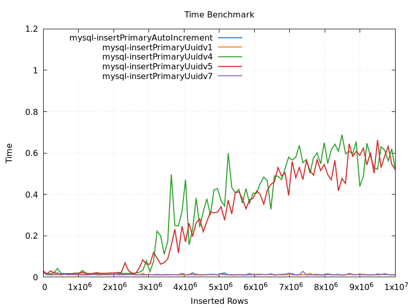
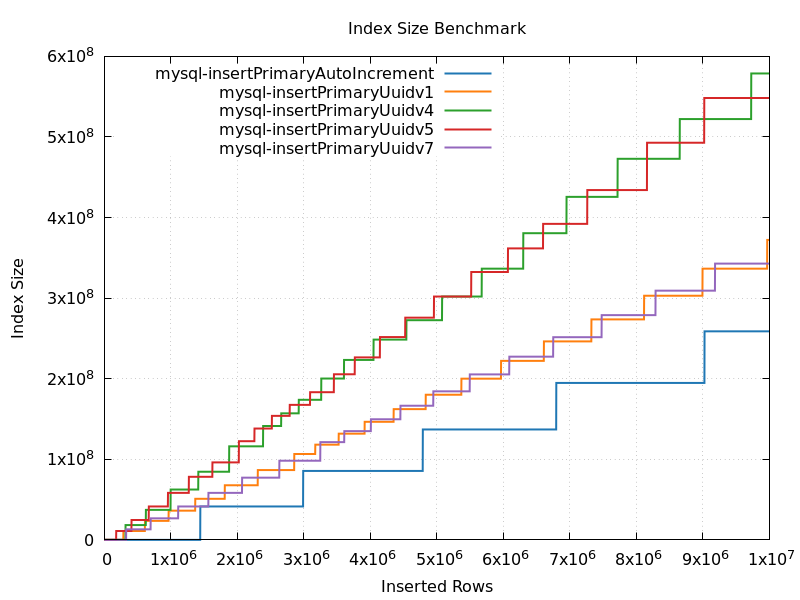

#### Percona 8.0 InnoDb

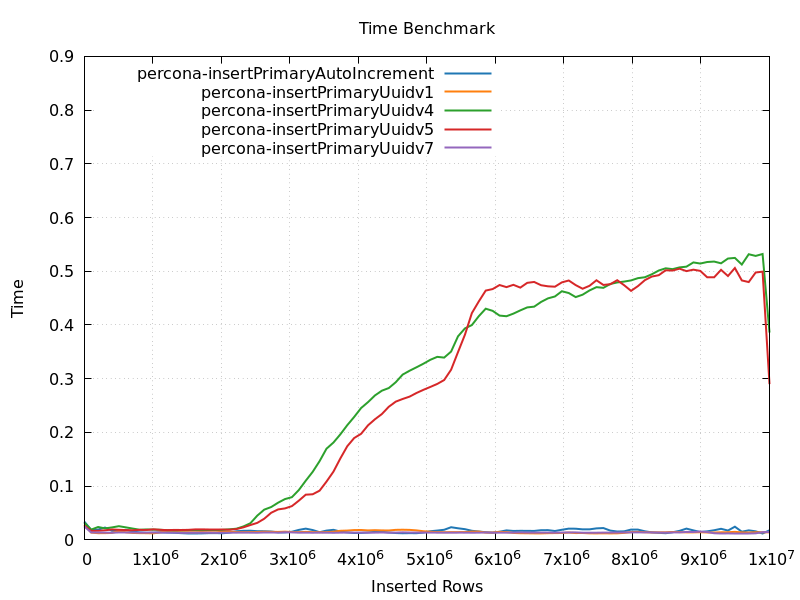
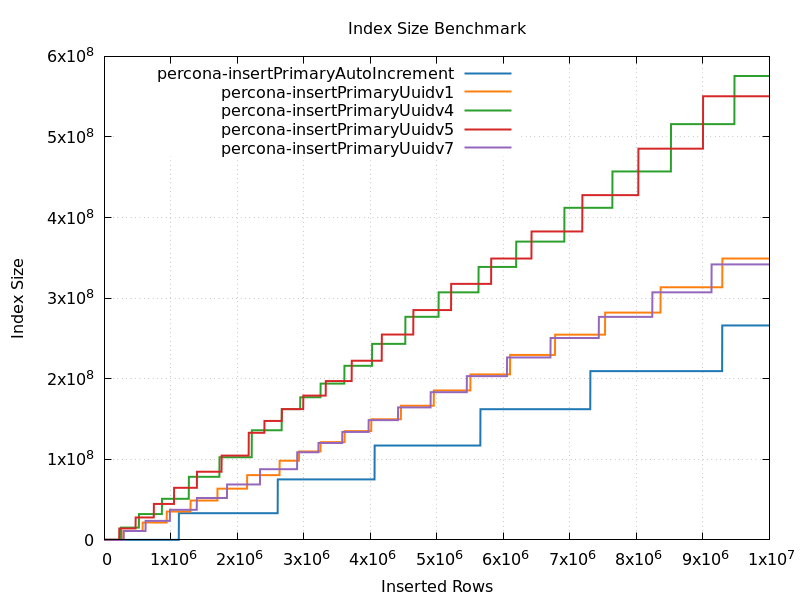

#### MariaDB 10.11 InnoDb

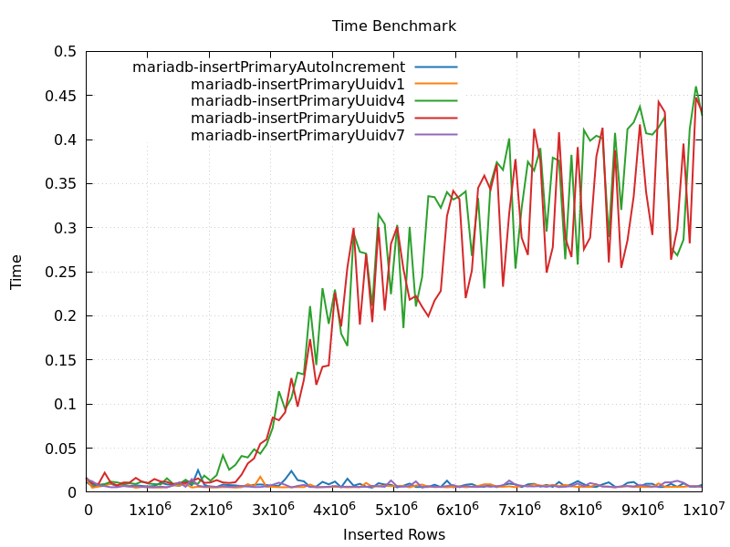
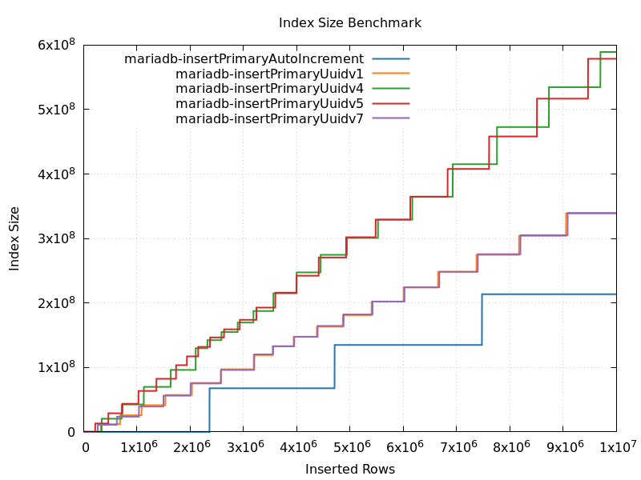

#### Postgres 15.2

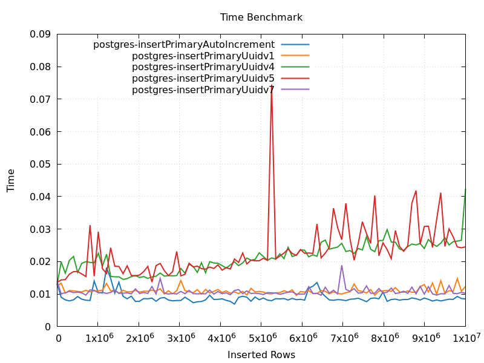
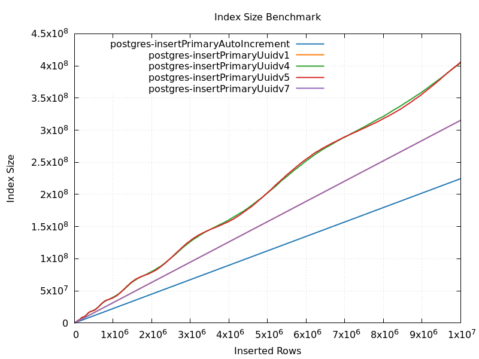

#### MongoDB 6.0

MongoDb has no auto increment feature, so external sequence used and MongoDB just insert integers.

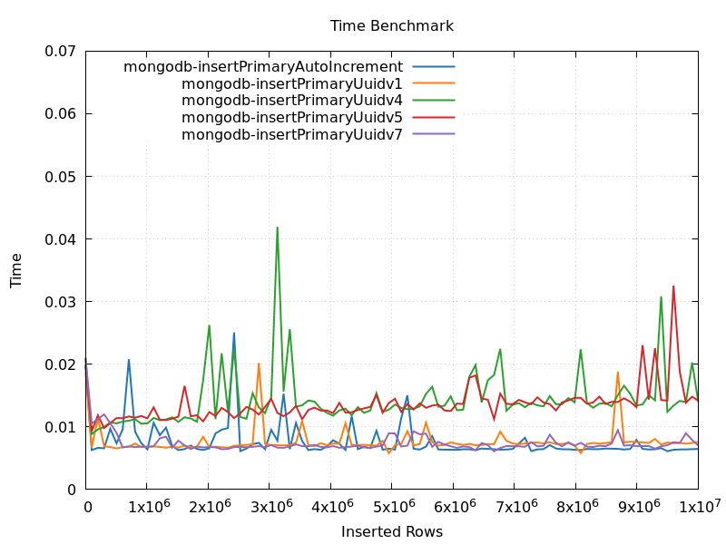
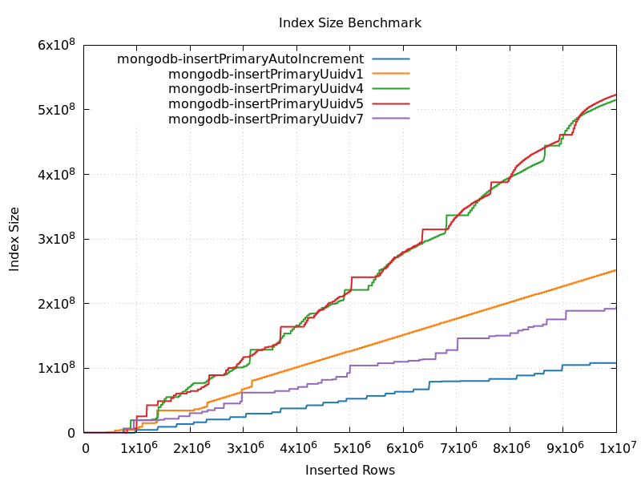

### Insert To Secondary Index

Records inserted by batch 5000 times with size 2000. Total amount of records - 10kk.

#### MySQL 8.0 InnoDb

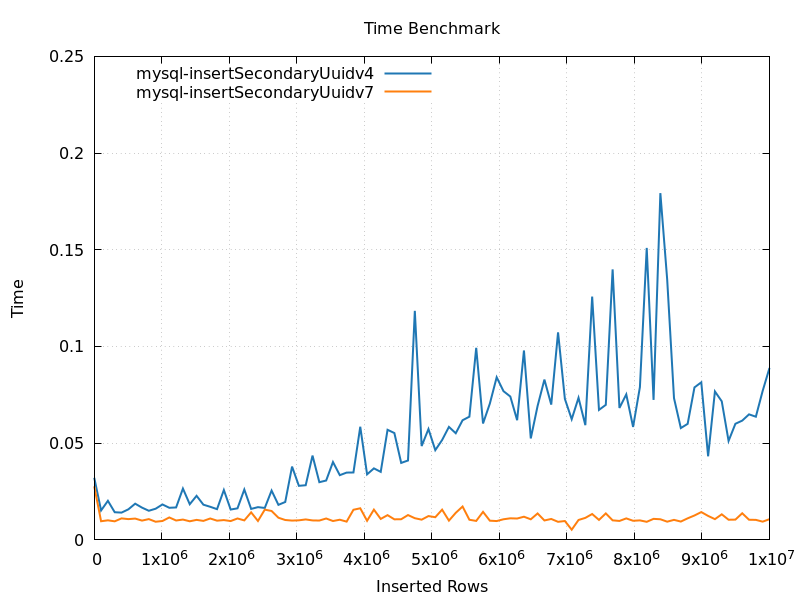
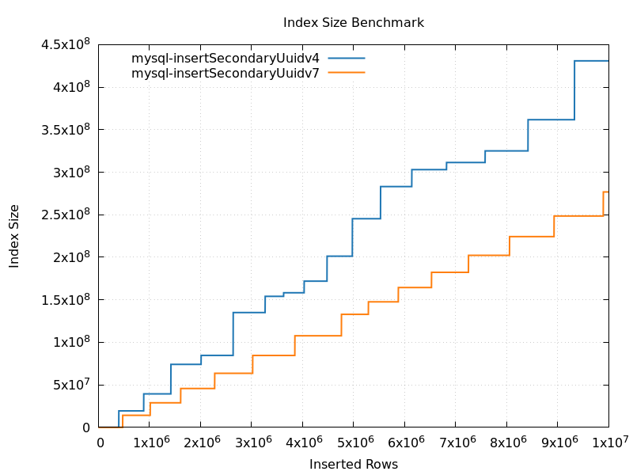

## Materials

* https://www.percona.com/blog/uuids-are-popular-but-bad-for-performance-lets-discuss/
* https://www.ietf.org/rfc/rfc4122.txt
* https://uuid6.github.io/uuid6-ietf-draft/
